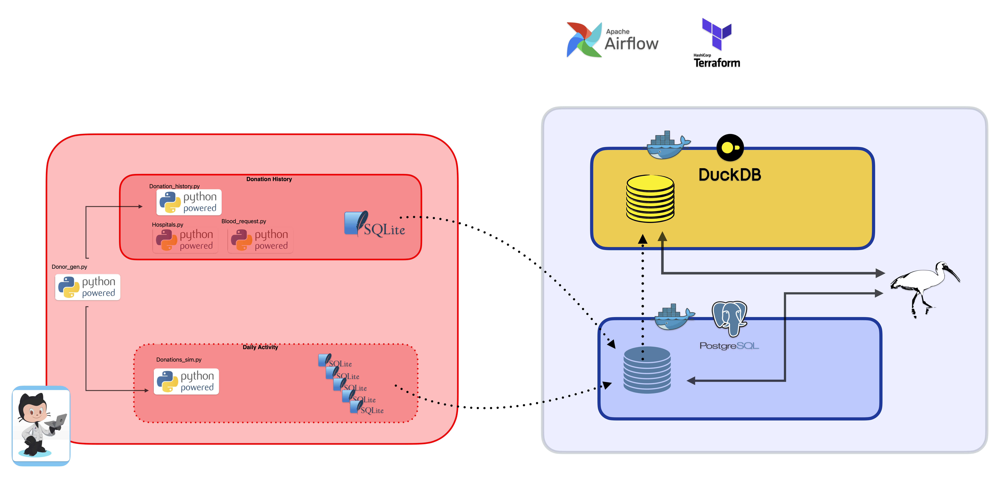
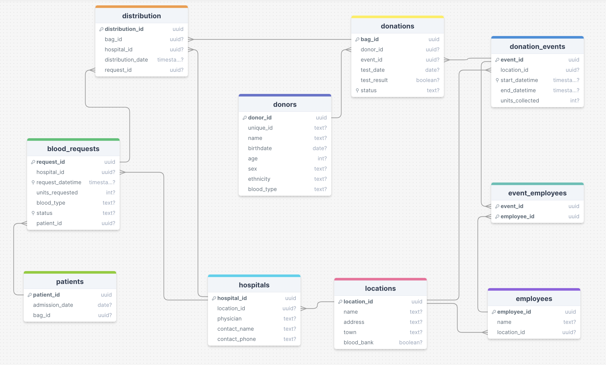

# 
 Hemolytics 

A data engineering project to model regional blood supply. It ingests data generated from CrimsonCache. that pipelines and analyzes data from to monitor blood bank inventory.

## Table of Contents

- [Status](#status)
- [Project Design](#design)

- [Why 'hemolytics'](#why)
   

## Status: In development

  
## Project Design 
Let's start with a picture:

On the left and in red is [CrimsonCache](https://github.com/hrokr/CrimsonCache) you can go there to see a bigger version and more information. It's provides the data for this project. 

Initially, CrimsonCache was just for SQL practice using a novel dataset. Then I thought that with just of bit of expansion I could also allow for analysis of a dynamic set. That started a chain of 'what ifs' and now we're here.

On the right and in blue is the current system architecture diagram for Hemolytics. But remember this is a model of what I think a blood supply *might* be be like but with the realization of not knowing anyone who could tell me how the system actually works, so expect this to change as I decide what I might want.

One more thing. CrimsonCache uses this schema:

I don't see how that won't change. First, it doesn't capture elements of what I want to do. I would think (and I could be wrong here) this would be better done as a snowflake schemas for the distribution system and donation systems with perhaps some separate star schemas for things like employees, doctors, etc. The long pole in tent is that I know each of the different blood products has a different shelf life. So, if this just a synthetic dataset, why make something I'm not going to keep?

Basically, it comes down to:
1. I got an initial schema from a [research paper](https://github.com/hrokr/CrimsonCache?tab=readme-ov-file#about-the-schema).
2. I modified it some to what *seems* less wrong.
3. I can make changes later. 

## Why Hemolytics?
It's a portmanteau of Hemo (as in blood) and analytics. 

But ...

In medical terms, Hemolytics refers to substances or processes that cause hemolysis, which is the destruction of red blood cells and the release of their contents into the surrounding fluid. For example, hemolytic anemia. And with modeling, we can run all sorts of scenarios of creating and destroying blood supply.

And, frankly, the combination of a portmanteau and a real term was just too good not to use. 
 

